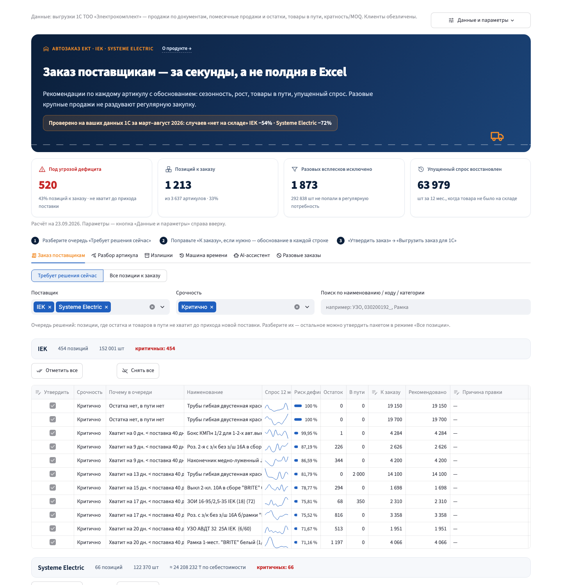
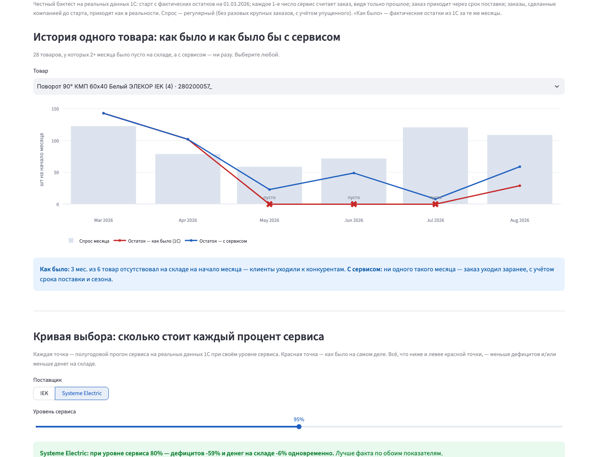
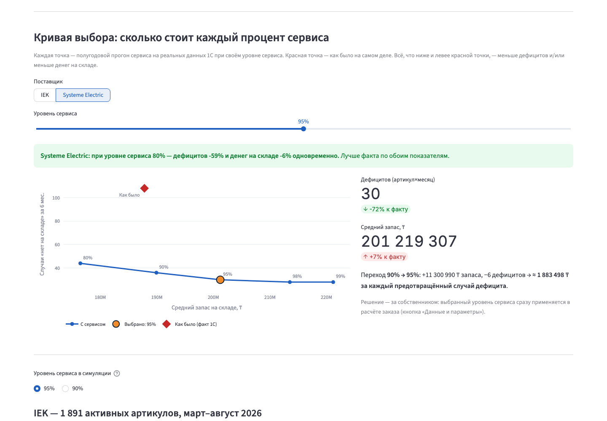

# Автозаказ ЕКТ — заказ поставщикам за секунды, а не полдня в Excel

> **Проблема.** Менеджер закупа «Электрокомплекта» вручную сводит в Excel продажи, остатки и товары в пути по
> 3 600 артикулам. Это полдня работы, поэтому заказ считают редко — одних товаров нет на складе, другие лежат лишними.
>
> **Решение.** Сервис по выгрузкам 1С сам считает, сколько заказать каждого товара и у какого поставщика, объясняет
> каждую строку человеческим языком и отдаёт готовый Excel для 1С. Человек только проверяет и утверждает.
>
> **Результат на реальных данных компании (март–август 2026):** случаев «товара нет на складе» — **−54% у IEK**
> (при этом запас **−5%**) и **−72% у Systeme Electric**.

**Кейс:** ТОО «Электрокомплект» (ekt.kz) · **Трек:** Логистика · **Стек:** Python · pandas · Streamlit · OpenAI ·
**Тесты:** 30 автотестов · **Ключи для проверки не нужны**



### Запуск за 1 минуту
```bash
./run.sh          # macOS / Linux  →  http://localhost:8501
run.bat           # Windows
```
Первая загрузка читает выгрузки 1С ~20 с. Питч-лендинг: http://localhost:8501/app/static/landing.html
(или двойной щелчок по [`app/static/landing.html`](app/static/landing.html)).

### Навигация и критерии оценки
| Критерий оценки | Где в README |
|---|---|
| Проблема и ценность | [2. Краткое описание](#2-краткое-описание) · [Результат на реальных данных](#результат-на-реальных-данных-ект) |
| Функциональность прототипа | [3. Что реализовано](#3-что-реализовано) · [4. Как работает](#4-как-работает-решение-сценарий-пользователя) · [8. Как проверить](#8-как-проверить-решение) |
| Техническая реализация | [5. Технологии](#5-технологии) · [6. Архитектура](#6-архитектура-проекта) |
| Практическая применимость | [12. Практическая применимость](#12-практическая-применимость) |
| Потенциал развития | [13. Потенциал развития](#13-потенциал-развития) |
| README и воспроизводимость | [7. Установка и запуск](#7-установка-и-запуск) · [8. Как проверить](#8-как-проверить-решение) · [9. Данные](#9-данные-и-интеграции) · [10. Ограничения](#10-ограничения) |

---

## 1. Название
**Автозаказ ЕКТ** — сервис рекомендованных заказов поставщикам для пополнения склада дистрибьютора.

## 2. Краткое описание
**Какую проблему решает.** Расчёт пополнения склада вручную в Excel занимает полдня, поэтому делается редко и
«на глаз». Разовые крупные продажи одному клиенту выглядят как рост спроса и раздувают закупку. Итог — дефицит по
одним позициям (клиент уходит к конкуренту) и излишки по другим (деньги заморожены на складе).

**Для кого.** Основной пользователь — менеджер отдела закупа. Собственник и финансист выбирают, сколько денег держать
в запасе ради уровня сервиса («Кривая выбора»).

**В чём ценность.**
- Заказ по всем 3 600 артикулам — за секунды, с обоснованием каждой строки: менеджер разбирает только очередь
  «Требует решения сейчас», а не весь ассортимент.
- «Симулятор склада»: до утверждения видно, что будет с остатком по дням, если заказать больше или меньше.
- Разовые крупные продажи не искажают закупку; месяцы, когда товара не было, досчитываются как упущенный спрос.
- Эффект доказан на истории компании: меньше дефицитов при том же или меньшем запасе (см. результаты ниже).
- Решение остаётся за человеком: правка с причиной, утверждение с ФИО, выгрузка в 1С; автоотправки нет.

**Доказательство на истории — «как было» и «как было бы с сервисом», кривая выбора:**




Сценарий демо на 3 минуты — [`docs/DEMO.md`](docs/DEMO.md).

## 3. Что реализовано

| Требование ТЗ | Как закрыто | Проверка |
|---|---|---|
| 1. Базовая потребность с учётом всех источников: история продаж, остатки, товары в пути, категории, прогноз прироста | Прогноз на горизонт «срок поставки + период пересмотра» + страховой запас − остаток − товары в пути, прибывающие до конца горизонта; категория задаёт сезонный профиль группы; прирост — параметр по поставщику (UI) | `tests/test_must_have.py::test_each_input_source_affects_calculation_or_is_supported` |
| 2. Сезонность и устойчивый рост | Сезонные индексы классической декомпозиции (отношение к центрированной 12-мес. скользящей средней). Собственный профиль артикула используется, если он повторяется по годам (корреляция профилей), иначе — профиль группы «поставщик × категория». Рост г/г учитывается только если он устойчив (одинаков по знаку в обоих полугодиях), с затуханием | `test_seasonal_forecast_has_summer_peak` |
| 3. Упущенный спрос в периоды stockout | По помесячным остаткам 1С определяется доля месяца в наличии; месяцы дефицита досчитываются до ожидаемого уровня; базовый уровень считается только по месяцам, когда товар был | `test_stockout_recovers_lost_demand_and_raises_level` |
| 4. Исключение разовых крупных заказов, включая крупные продажи одному клиенту | Документ с количеством выше робастного порога `max(Q3 + 3·IQR, 5·медиана, 2·P90)` по документам артикула урезается до «обычного» заказа (медиана), излишек исключается из регулярного спроса. При наличии поля клиента — дополнительно агрегат «клиент × месяц». Повторяющиеся крупные заказы (≥ 4 месяцев за год) считаются регулярным оптом и остаются. Для 2024 г. (нет документов) — ограничение месяца 3× медианы | `test_big_oneoff_is_excluded_from_regular_level`, вкладка «Разовые заказы» |
| 5. Итоговый список по поставщикам с обоснованием | Таблица по поставщикам, у каждой строки текст: прогноз, сезонность, рост, страховой запас, остаток, в пути, кратность, упущенный спрос, исключённые заказы | `test_order_output_has_reason_supplier_groups_and_moq_multiples`, вкладка «Заказ поставщикам» |
| Опц.: приоритизация по риску дефицита | Срочность «Критично / Высокая / Плановая» по покрытию остатком срока поставки; шкала риска; сортировка | UI |
| Опц.: минимальная партия и условия поставщика | Округление вверх до кратности/MOQ из файлов поставщиков; срок поставки — по поставщику | UI, тест 5 |
| **Симулятор склада** (сверх ТЗ) | Ползунок «заказать N шт» → остаток по дням до прихода следующего заказа: когда товар закончится, сколько дней без товара и сколько продаж потеряно, сколько пролежит лишнего — до нажатия «Утвердить» | вкладка «Разбор артикула», `tests/test_simulate.py` |
| Опц.: визуализация трендов | График «факт / регулярный спрос / прогноз», месяцы без товара подсвечены | вкладка «Разбор артикула» |
| Опц.: выгрузка заказа | Excel по листам-поставщикам (код 1С, артикул, количество, обоснование) — для загрузки в 1С | кнопка «Выгрузить заказ для 1С (Excel)» |
| Избыточные запасы (из «Проблема и ценность» ТЗ) | Вкладка «Излишки»: запас сверх максимума политики (прогноз на горизонт + страховой запас), в шт и ₸ по себестоимости | UI |
| ABC-классификация | A/B/C по годовому регулярному спросу внутри поставщика (80/15/5%) — колонка в заказе и излишках | UI |
| Масштабирование на любую компанию | «Данные и параметры» → «Загрузить свой файл»: один Excel с листами `sales`, `stock_now`, `transit`, `items`, `stock_hist`, `stockouts` (два последних — необязательно); кнопка «Скачать шаблон (пример)» | `tests/test_upload.py` |
| Ограничение: без автоотправки | Заказ только утверждается человеком (ФИО + время, файл в `data/approved/`); AI-ассистент готовит лишь черновик письма | UI |
| Ограничения: приватность, объяснимость, устойчивость к выбросам | Данных о клиентах в выгрузке нет; расчёт детерминированный и объяснённый; робастные пороги (IQR, MAD) для выбросов и страхового запаса | код `engine/core.py` |

**AI-ассистент закупщика** (OpenAI, function calling): отвечает на вопросы («что критично по IEK?», «почему столько по
этой позиции?») только через инструменты над результатами расчёта и готовит черновик письма-заказа поставщику.
Без ключа работает детерминированный режим — сервис полностью проверяется без личных аккаунтов.

### Результат на реальных данных ЕКТ

Бэктест «Машина времени»: с 01.03.2026 по 31.08.2026 заказы каждое 1-е число считает сервис (видит только прошлое),
старт — с фактических остатков 1С. Сравнение с фактическими остатками 1С за те же месяцы.
Метрика дефицита одинакова для обеих сторон: начальный остаток месяца = 0 при наличии спроса (артикул × месяц).

<!-- RESULTS:START -->
| Поставщик | Активных артикулов | Случаи «нет на складе» (артикул×месяц): было → с сервисом | Средний запас |
|---|---|---|---|
| IEK | 1891 | 1648 → **760 (−54%)** при сервисе 95% · 770 (−53%) при 90% | −5% шт (95%) · −8% шт (90%) |
| Systeme Electric | 472 | 108 → **30 (−72%)** при сервисе 95% · 36 (−67%) при 90% | +7% ₸ по себестоимости (95%) · +1% ₸ (90%) |

Из сравнения исключены 133 артикулов «под заказ» (ни разу не были на складе на начало месяца — склад их держать не должен). Воспроизведение: `python -m scripts.backtest 1.65` и `python -m scripts.backtest 1.28` → `data/results/*.json`.

Неудовлетворённый спрос в штуках (для прозрачности; для «как было» виден только в месяцы с нулём на начало, поэтому занижен и несопоставим с симуляцией): IEK: было ≥16 209, с сервисом 29 149 шт; Systeme Electric: было ≥7 587, с сервисом 33 325 шт.

**Точность прогноза на истории** (`python -m scripts.accuracy`: отсечки 01.04–01.06.2026, горизонт 3 мес., только месяцы с товаром в наличии, WAPE — меньше лучше): IEK — 36.2% против 36.8% у «среднего за 12 мес.»; Systeme Electric — 32.2% против 30.3% у «среднего за 12 мес.». Помесячный спрос по артикулу сильно зашумлён, поэтому сезонность применяется только при подтверждённой повторяемости (параметры подобраны по этой проверке); основной эффект даёт политика заказа — см. таблицу выше.

**Кривая выбора** (вкладка «Машина времени», прогоны при сервисе 80/90/95/98/99%): есть уровни сервиса, где сервис лучше факта **сразу по обоим показателям** — IEK — при сервисе 80%: дефицитов −52% и запаса −11% шт; Systeme Electric — при сервисе 80%: дефицитов −59% и запаса −6% ₸.
<!-- RESULTS:END -->

## 4. Как работает решение (сценарий пользователя)
1. Менеджер открывает сервис → видит KPI: позиции под угрозой дефицита, к заказу, исключённые всплески, восстановленный спрос.
2. Кнопка «Данные и параметры»: источник данных (кейс ЕКТ или свой Excel), сроки поставки, период пересмотра, уровень сервиса, план прироста.
3. Во вкладке «Заказ поставщикам» (по умолчанию — режим «Требует решения сейчас») фильтрует по поставщику, срочности и полю «Поиск по наименованию / коду / категории», правит «К заказу», использует кнопки «Отметить все» и «Снять все».
4. Поле «Кто утверждает (ФИО)» и кнопка «Утвердить заказ» → файл заказа; кнопка «Выгрузить заказ для 1С (Excel)» → Excel по поставщикам.
5. «Разбор артикула» — график и обоснование; «Машина времени» — эффект на истории; «AI-ассистент» — вопросы и черновик письма.

## 5. Технологии
- **Язык и данные:** Python 3.11+, pandas, numpy, openpyxl / xlsxwriter (чтение выгрузок 1С и экспорт Excel).
- **Интерфейс:** Streamlit (веб-приложение), Plotly (графики), собственные CSS/SVG (без эмодзи), статичный лендинг `app/static/landing.html`.
- **Методы расчёта:** робастная статистика (IQR, MAD), классическая сезонная декомпозиция (центрированная 12-мес. средняя),
  страховой запас по уровню сервиса, политика периодического пересмотра заказа, бэктест-симуляция.
- **AI в продукте:** OpenAI API (модель задаётся `OPENAI_MODEL`, по умолчанию `gpt-5.4-mini`), function calling над
  результатами расчёта; без ключа — детерминированный режим.
- **Качество:** pytest (must-have ТЗ, граничные случаи, бэктест, загрузчики, интерфейс через Streamlit AppTest).
- **AI-агенты в разработке:** Claude Code и OpenAI Codex (код, тесты, два раунда код-ревью, лендинг).

## 6. Архитектура проекта
```
data/raw/*.xlsx (выгрузки 1С)
   │  engine/loaders.py — приведение к единой схеме:
   │  sales(date, sku, qty, doc, warehouse[, client]) · stock_hist · stock_now · transit · items · monthly_hist
   ▼
engine/core.py  compute_orders(): разовые заказы → чистый спрос → сезонность → stockout → уровень/рост
                → прогноз на горизонт → страховой запас → потребность − остаток − в пути → кратность → срочность → обоснование
   ├── engine/backtest.py  «Машина времени» (симуляция политики заказов на истории)
   ├── engine/agent.py     AI-ассистент (function calling над результатами, фолбэк без ключа)
   └── engine/llm.py       обёртка LLM (заранее подготовленная инфраструктура)
app/app.py + app/ui.py  Streamlit-интерфейс: заказ, утверждение, экспорт, графики, ассистент
tests/                  pytest: must-have на синтетических данных (scripts/make_synthetic.py)
```

## 7. Установка и запуск
Требования: Python 3.11+ (проверено на 3.14), macOS / Linux / Windows.

```bash
git clone git@github.com:BAITC-Hacks/hack-4bb3095c-resource.git
cd hack-4bb3095c-resource
./run.sh                      # macOS/Linux: создаст .venv, поставит зависимости, запустит http://localhost:8501
# Windows: run.bat
```

Вручную (в т.ч. Windows):
```bash
python -m venv .venv
.venv/bin/pip install -r requirements.txt        # Windows: .venv\Scripts\pip install -r requirements.txt
.venv/bin/streamlit run app/app.py               # Windows: .venv\Scripts\streamlit run app/app.py
```
Первый запуск читает Excel-выгрузки (~15–20 с) и кэширует их в `data/cache/`.

### Переменные окружения (необязательно)
Нужны только для AI-ассистента в режиме LLM. Скопируйте `.env.example` в `.env`:

| Переменная | Назначение |
|---|---|
| `OPENAI_API_KEY` | ключ OpenAI API |
| `OPENAI_MODEL` | модель, напр. `gpt-5.4-mini` |

Без ключа ассистент отвечает детерминированно по тем же данным.

## 8. Как проверить решение
```bash
.venv/bin/python -m pytest -q                 # тесты: 5 must-have ТЗ, граничные случаи, бэктест, загрузчики реальных данных, ассистент, загрузка своих данных
.venv/bin/python -m scripts.backtest 1.65     # пересчёт «Машины времени» (~1–2 мин)
.venv/bin/python -m scripts.accuracy          # точность прогноза на истории
```
Windows: те же команды через `.venv\Scripts\python.exe`, например `.venv\Scripts\python.exe -m pytest -q`.
Проверка вручную в UI: вкладка «Разбор артикула» → выберите любую позицию (напр. `030300014_`): видно исключённые разовые
документы, месяцы без товара, прогноз; вкладка «Разовые заказы» — все исключения с документами.

## 9. Данные и интеграции
- `data/raw/` — выгрузки 1С, предоставленные партнёром: продажи по документам (фактически с 01.2025), помесячные
  продажи и материальная ведомость — начальные остатки по месяцам (с 01.2024), товары в пути (IEK — по документам с датами поступления, SE — «в пути 24.09»),
  кратность/MOQ, рабочая таблица SE (категория, свободный остаток, себестоимость «СС реал»).
- Данные о клиентах в выгрузках отсутствуют; код поддерживает необязательное обезличенное поле `client`.
- Синтетические данные (`scripts/make_synthetic.py`) — только для тестов.
- Внешние сервисы: OpenAI API — опционально, только для AI-ассистента.

### Сторонние компоненты и заготовки (раскрытие по п. 5.4.4 положения)
| Что | Где используется | Лицензия / источник |
|---|---|---|
| pandas, numpy, openpyxl, xlsxwriter | расчёт, чтение выгрузок 1С, экспорт Excel | BSD-3 / MIT (open source) |
| Streamlit, Plotly | веб-интерфейс, графики | Apache-2.0 / MIT |
| openai (Python SDK), python-dotenv, pydantic | AI-ассистент, настройки | Apache-2.0 / BSD / MIT |
| pytest | автотесты | MIT |
| Модель OpenAI `gpt-5.4-mini` (через API) | AI-ассистент (необязательно; без ключа — офлайн-режим) | OpenAI API, кредиты хакатона |
| Шрифт Inter (Google Fonts) | интерфейс и лендинг | SIL Open Font License 1.1 |
| Иконки Material Symbols (встроены в Streamlit) | вкладки и кнопки интерфейса | Apache-2.0 |
| SVG-иконки и иллюстрации (склад, грузовик и др.) | шапка, KPI, лендинг | нарисованы командой (в стиле Lucide, код не заимствован) |
| Данные ТОО «Электрокомплект» (`data/raw/`) | расчёт и бэктест | предоставлены партнёром кейса для хакатона |
| Синтетические данные (`scripts/make_synthetic.py`) | только тесты | сгенерированы командой |

**AI-инструменты разработки:** Claude Code (Anthropic) и OpenAI Codex — написание кода, тестов, два раунда код-ревью,
лендинг. **Заранее подготовлено до 13:00:** только инфраструктурная обёртка LLM (`engine/llm.py`), `AGENTS.md`
(правила для AI-агентов) и памятки подготовки (`HACKATHON_CONTEXT.md`, `GATES.md`); вся функциональность кейса написана во время соревновательной части — см. историю коммитов.
Скриншоты `docs/img/` сняты с работающего приложения.

## 10. Ограничения
- Периоды stockout определяются по материальной ведомости 1С (помесячные начальные остатки); явные периоды можно
  дополнительно передать листом `stockouts` (sku, month, avail) при загрузке своих данных.
- Сроки поставки в данных не переданы — заданы в UI (по умолчанию IEK 40 дн., SE 30 дн. — оценка по датам документов «в пути»).
- Текущий остаток IEK = начальный остаток сентября − продажи сентября (поступления сентября в выгрузке нет); у SE — «Свободный остаток».
- Бэктест — месячный шаг; товар, пришедший до 15-го, доступен для продаж месяца; себестоимость есть только у SE.
- Бэктест: объём неудовлетворённого спроса в штуках для «как было» и «с сервисом» несопоставим (для факта виден только
  в месяцы с нулём на начало, в симуляции — любой недостаток внутри месяца). Поэтому основная метрика — число случаев
  «нет на складе на начало месяца», одинаковое для обеих сторон; объём приведён в разделе результатов для прозрачности.
- Склад в выгрузке один (Алматы); расчёт по нескольким складам поддерживается схемой (`warehouse`), но UI показывает общий.
- Деплой: локальный запуск (`./run.sh`).

## 11. Ссылка на развёрнутую версию
Публичного развёртывания нет: данные партнёра не публикуются в открытом доступе. Решение запускается локально одной
командой (`./run.sh` или `run.bat`) → http://localhost:8501; лендинг — http://localhost:8501/app/static/landing.html.

## 12. Практическая применимость
**Где и кем используется.** Отдел закупа дистрибьютора электротехники (в кейсе — ТОО «Электрокомплект», поставщики IEK
и Systeme Electric): еженедельный или ежемесячный цикл заказа поставщикам.

**Какую задачу закрывает уже сейчас:**
- расчёт заказа по всем артикулам и поставщикам вместо ручного Excel;
- очередь решений: что заказать срочно и почему (остатка не хватит до прихода поставки);
- контроль излишков: сколько денег лежит в запасе сверх нужного (вкладка «Излишки», в ₸);
- аудит: что рекомендовал сервис, что поменял человек и почему (файл утверждения).

**Как внедряется без ИТ-проекта:** выгрузка Excel из 1С → расчёт → Excel обратно в 1С. Любая другая компания
загружает свои данные по шаблону («Данные и параметры» → «Загрузить свой файл»), интеграция не требуется.

## 13. Потенциал развития
Во что проект может вырасти после хакатона:
1. **Все поставщики и склады компании** — в схеме данных уже есть поставщик, склад и (обезличенный) клиент; следующий
   шаг — расчёт по каждому складу и сроки поставки по фактическим документам поступления.
2. **Прямая интеграция с 1С** (выгрузка по расписанию и загрузка «Заказа поставщику») — ежедневный пересчёт без ручных файлов.
3. **Самообучение на правках менеджера:** причины правок накапливаются и показывают, где модель систематически
   ошибается (сроки, акции, крупные клиенты).
4. **Условия поставщиков:** минимальная сумма заказа, скидки за объём, консолидация машины/паллеты.
5. **Перераспределение излишков** между складами и акции на залежавшийся товар.
6. **Другие отрасли с той же задачей:** дистрибуция стройматериалов, автозапчастей, FMCG, аптечные сети — везде, где
   есть склад, поставщики и 1С/ERP.
7. **AI-агент закупщика:** ежедневная сводка «что критично» и черновики писем поставщикам — с утверждением человеком.
